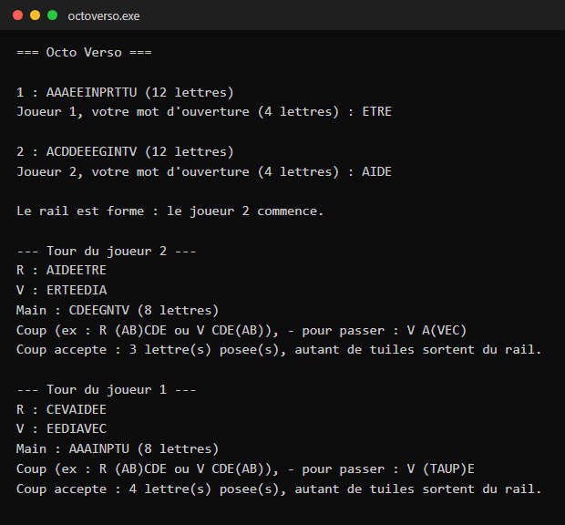
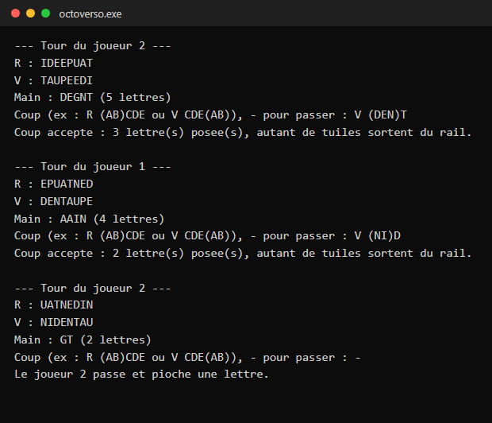
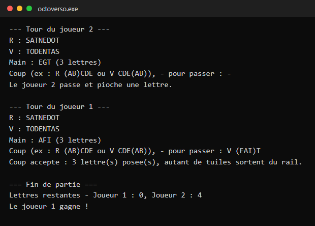

# 🧩 OctoVerso

Projet étudiant – **BUT1 Informatique**
Réalisé par : **VEER Tanim**

Jeu de lettres en console, en C, pour deux joueurs : on forme des mots en faisant glisser ses
lettres sur un rail de 8 tuiles double face. Le premier joueur qui vide sa main gagne.
Vidéo d'inspiration : https://www.youtube.com/watch?v=qYaOiUVmqj0

---

## 🚀 Captures

Extraits d'une vraie partie (sortie exacte du programme) :

| Début de partie | Partie en cours | Fin de partie |
|---|---|---|
|  |  |  |

---

## 🎮 Règles

- **Le paquet** contient 88 tuiles. Chaque joueur en reçoit 12.
- **L'ouverture** : chaque joueur propose un mot de 4 lettres tiré de sa main. Les deux mots
  forment le rail de 8 tuiles, le plus petit dans l'ordre alphabétique à gauche. Le joueur qui
  l'a proposé commence.
- **Le rail a deux faces** : chaque tuile est double face, donc retourner le rail donne le verso,
  c'est-à-dire le recto lu à l'envers (`R : AIDEETRE` ↔ `V : ERTEEDIA`).
- **Un coup** se note `R (AB)CDE` ou `R CDE(AB)` (ou `V` pour jouer sur le verso) :
  - les lettres **entre parenthèses** viennent de la main, et il en faut au moins une ;
  - les autres lettres doivent être celles du **bord du rail** (le début pour `(AB)CDE`, la fin
    pour `CDE(AB)`), et il en faut au moins une ;
  - le mot complet doit exister dans le dictionnaire et ne pas avoir déjà été joué.
  Les lettres posées entrent dans le rail par ce bord, et autant de tuiles sortent par le bord
  opposé : elles sont défaussées.
  Exemple : sur le verso `ERTEEDIA`, le coup `V A(VEC)` forme AVEC, et le verso devient `EEDIAVEC`.
- **Octo Verso** : un mot de 8 lettres, qui couvre donc tout le rail, donne le droit de rejouer.
- **Passer** (`-`) : le joueur pioche une lettre, s'il en reste dans le paquet.
- **Fin de partie** : le premier joueur qui vide sa main gagne. Si le paquet est vide et que les
  deux joueurs passent l'un après l'autre, c'est celui qui a le moins de lettres qui gagne.

> Le sujet original du projet n'étant plus disponible, ces règles sont une **reconstruction**
> faite à partir du code d'origine : la taille du rail, les 88 tuiles et la syntaxe `R (...)`
> qu'il essayait déjà de lire. Le jeu de référence peut différer sur certains détails.

**Dictionnaire** : `OctoVerso/ods4.txt` contient environ 660 mots français courants de 3 à 8 lettres,
sans accents comme au Scrabble. Ce n'est pas l'ODS officiel complet, mais on peut le remplacer par
une vraie liste (un mot par ligne, en majuscules).

---

## 🛠️ Architecture

- `main.c` : lecture des saisies, tours de jeu, fin de partie
- `joueur.c/h` : main du joueur, analyse et validation des coups, dictionnaire
- `rail.c/h` : rail de 8 tuiles, lecture recto/verso, glissement des tuiles
- `paquet.c/h` : paquet de 88 tuiles, mélange (Fisher-Yates), pioche

---

## ▶️ Lancement

Avec Visual Studio : ouvrir `OctoVerso.sln` et lancer le projet.

Avec GCC ou Clang :

```bash
git clone https://github.com/tanim-veer/octoverso-c-game.git
cd octoverso-c-game/OctoVerso
gcc -std=c11 -Wall -Wextra -o octoverso main.c joueur.c rail.c paquet.c
./octoverso
```

Le fichier `ods4.txt` doit être dans le dossier courant au lancement.

---

## 🐛 Historique : bugs corrigés

Une revue de code a trouvé plusieurs bugs qui empêchaient le jeu de fonctionner :

- **Boucle infinie** : la condition de fin de partie testait `etatPartie`, qui était une
  constante d'énumération valant toujours 0, et non une variable d'état.
- **Erreur de type** : des appels passaient un `Joueur*` à des fonctions qui attendaient un `Rail*`.
- **Dépassements de tas (heap overflow)** :
  - le tableau des fréquences de lettres totalisait 97 tuiles pour un tampon de 88 (`MAX_CARTES`),
    donc 9 lettres étaient écrites hors de la mémoire allouée. Les fréquences elles-mêmes étaient
    fausses (6 Q pour un seul U) et ont été corrigées pour totaliser 88 ;
  - la main du joueur était réallouée à une taille plus petite, alors que plusieurs fonctions la
    parcouraient toujours sur 12 cases ;
  - `piocherLettreduPaquet` lisait une case au-delà de la dernière lettre valide.
- **Logique** : `verifMots` écrasait le mot du joueur avec les mots du dictionnaire pendant la
  vérification. `j->mot` n'était jamais rempli, alors qu'il servait à choisir qui commence.
  L'affichage du rail le triait par ordre alphabétique, ce qui modifiait le rail lui-même.
- **Jeu incomplet** : la boucle principale ne lisait aucun coup. Il y a maintenant de vrais tours
  de jeu, une fin de partie, et une sortie propre si l'entrée est fermée.

Le code compile sans aucun avertissement avec `-Wall -Wextra`.

---

## Auteur

Tanim Veer, étudiant en BUT Informatique (parcours Data & IA)

[GitHub](https://github.com/tanim-veer) · [Portfolio](https://tanim-veer.fr)
